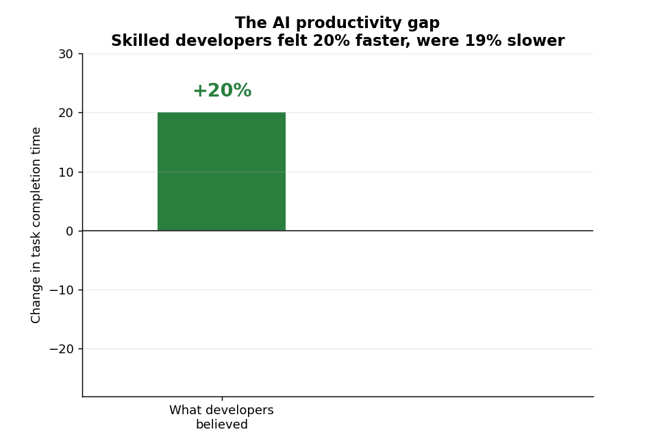
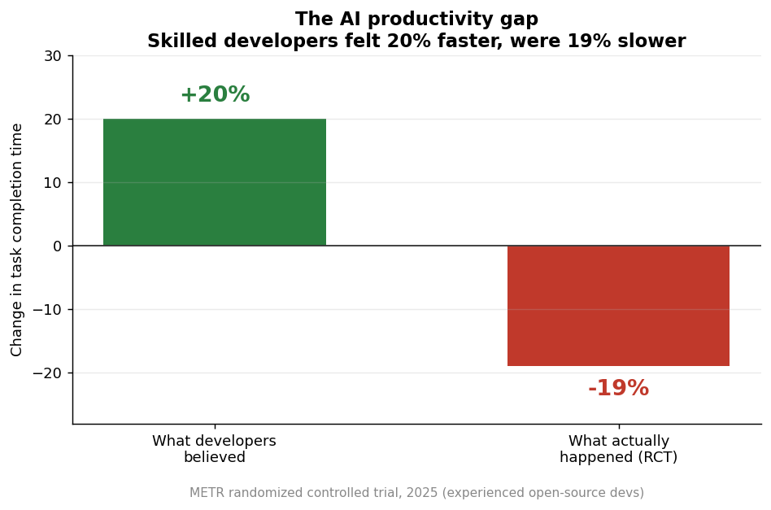
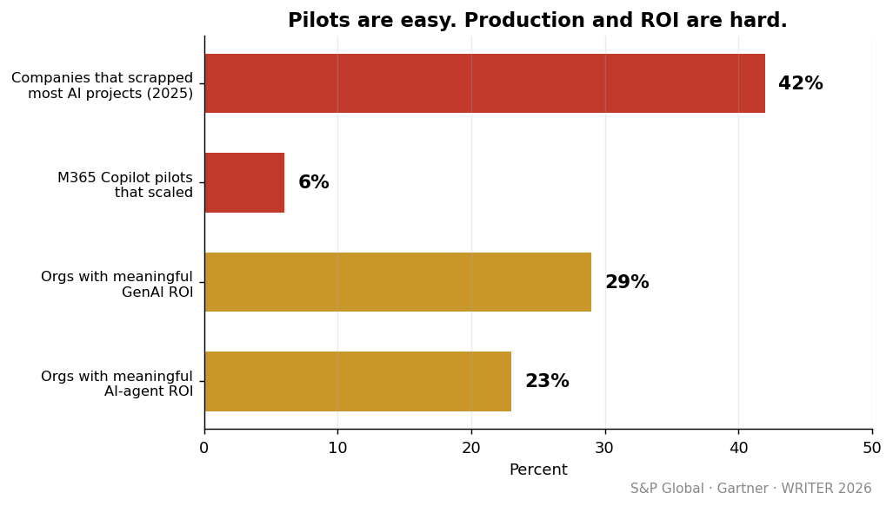
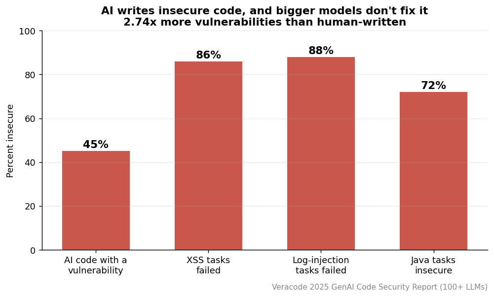
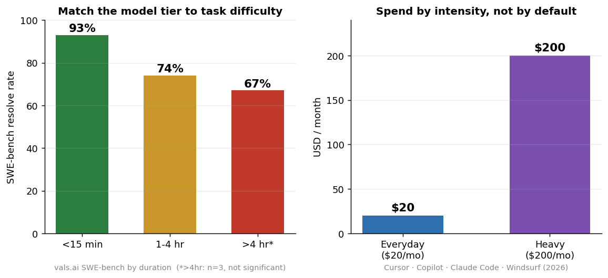

<h1 align="center">Enterprise AI Adoption Playbook (2026)</h1>

<p align="center">
  <em>어떤 모델·에이전트·세팅으로 효율을 극대화하는가. 일반 기업용, 벤더 중립, 정직한 트레이드오프.</em>
</p>

<p align="center">
  
  
  
  
</p>

<p align="center"><strong>IOV Labs (아이오브연구소)</strong> · 출처 기반·정직한 기업 AI 도입 플레이북</p>

---

<p align="center">
  
</p>
<p align="center"><sub>숙련 개발자는 AI로 20% 빨라졌다고 <b>느꼈지만</b> 실제로는 19% <b>느려졌다</b> (METR RCT, 2025). 이 한 장이 플레이북의 출발점이다: 체감이 아니라 측정.</sub></p>

## 한 줄 결론

> **도구는 이미 성숙했다. ROI를 가르는 건 도구가 아니라 통제 시스템이다.** 파일럿은 쉽고, 프로덕션·ROI는 어렵다.

대부분의 "AI 도입" 조언은 도구 목록이다. 그건 틀린 목록이다. 도구는 이미 충분히 좋고, 효과를 가르는 건 그 도구를 둘러싼 통제 시스템(자동 테스트·버전관리·빠른 피드백·인간 리뷰·측정)이다.

- 📄 **전체 문서(한국어)**: [`PLAYBOOK.ko.md`](PLAYBOOK.ko.md)
- 📑 **발행용 PDF (9pp)**: [`paper/paper.pdf`](paper/paper.pdf)
- 🌐 **사이트**: [labs.iovstudio.kr/ko/papers/enterprise-ai-playbook](https://labs.iovstudio.kr/ko/papers/enterprise-ai-playbook)

## 목차

- [핵심 발견 (검증된 숫자)](#핵심-발견-검증된-숫자)
- [무엇이 들어있나 (8개 섹션)](#무엇이-들어있나-8개-섹션)
- [그림](#그림)
- [방법론·정직성](#방법론정직성)
- [정직한 한계](#정직한-한계)
- [어떻게 만들었나](#어떻게-만들었나)
- [인용 · 라이선스](#인용--라이선스)

## 핵심 발견 (검증된 숫자)

적대적 3표 교차검증을 통과했거나 직접 재검색으로 확인한 것만.

| 지표 | 수치 | 출처 | 검증 |
|---|---|---|---|
| AI 업무 사용률 | 90%, 생산성 체감 80%+ | DORA 2025 | ✅ 검증완료 |
| AI 코드 신뢰 | 30%가 거의/전혀 불신 | DORA 2025 | ✅ 검증완료 |
| 체감 vs 실제 | **19% 더 느려짐**, 본인은 20% 빨라졌다 착각 | METR 2025 | ✅ 검증완료 |
| 조직 AI 프로젝트 폐기 | 2025년 **42%**가 대부분 폐기 (전년 2배+) | S&P Global | ✅ 검증완료 |
| 유의미 ROI | 생성형 29% / 에이전트 23% | WRITER 2026 | ✅ 검증완료 |
| M365 Copilot 파일럿→대규모 배포 | 단 **6%** | Gartner 2025 | ☑️ 스팟확인 |
| RAG도 환각함 (법률 AI) | Lexis+ 17% / Westlaw 33% | Stanford RegLab | ☑️ 스팟확인 |
| **AI 코드 보안** | **45%가 취약** (사람 2.74배), 큰 모델도 안전 안 함 | Veracode 2025 | ☑️ 스팟확인 |
| 환각 패키지(슬롭스쿼팅) | 코드 **19.7%**가 존재하지 않는 패키지 추천 | USENIX Security 2025 | ☑️ 스팟확인 |

> ❌ **기각한 통계**: 흔히 인용되는 "MIT 95% 파일럿 실패", "IBM CEO 25% ROI", "78% 에이전트 파일럿 운영"은 적대적 검증에서 출처 추적 불가/과장으로 **기각**했다. 플레이북에 쓰지 않는다.

## 무엇이 들어있나 (8개 섹션)

| # | 섹션 | 핵심 내용 |
|---|---|---|
| 1 | 현실 점검 | 정직한 검증 수치, 생산성 역설 |
| 2 | **개발·코딩** | 난이도별 모델 티어(93/74/67%), $20·$200 가격표, GitHub Agent HQ 오케스트레이션, 표준 워크플로 + **AI 코드 PR 리뷰 체크리스트** |
| 3 | **디자인·마케팅** | "AI 티" 제거: 왜 다 보라 그라데이션인가, **디자인 시스템 마크다운 템플릿**, "AI 티" 판별 체크리스트, [The Tells](https://labs.iovstudio.kr/ko/papers/ai-design-tells) 연계 |
| 4 | **업무 자동화** | RAG 도구·가격(M365 $30·Glean $40-80·Onyx $20), 환각 통제(RAG도 17-33% 환각), 빌드 vs 바이 트리, **유스케이스 4종 레시피** |
| 5 | **전략·ROI·거버넌스** | 측정 지표·우선순위 매트릭스, CDAO 조직 변화(70%·21→36%), "AI 스프롤", 온프레 vs 클라우드 경제성, SLM 3배 예측, 단계별 로드맵 |
| 6 | **보안·규제** | OWASP LLM Top 10, NIST AI RMF, 섀도우 AI, EU AI Act·GDPR 22조·한국 PIPA 37조의2, **AI가 만드는 보안 결함**(45% 취약·슬롭스쿼팅) |
| 7 | 치트시트 | 한 페이지 의사결정 요약 |
| 8 | 출처 | 1차/보조 구분, 검증 상태 |

## 그림

<table>
<tr>
<td width="50%"><br><sub><b>Fig 1.</b> 체감 vs 실제 생산성 괴리 (METR RCT). 느낌 +20%, 실제 −19%.</sub></td>
<td width="50%"><br><sub><b>Fig 2.</b> 파일럿은 쉽고 프로덕션·ROI는 어렵다. 42% 폐기, Copilot 6%만 확장.</sub></td>
</tr>
<tr>
<td width="50%"><br><sub><b>Fig 3.</b> AI 코드 45%가 취약, 큰 모델도 안전하지 않음 (Veracode 2025).</sub></td>
<td width="50%"><br><sub><b>Fig 4.</b> 난이도로 모델 티어를 가르고, 강도로 비용을 쓴다.</sub></td>
</tr>
</table>

## 방법론·정직성

- **deep-research 하네스 5개 패스**: 각 패스마다 검색 각도 분해 → 병렬 웹검색 → 소스 수집 → **적대적 3표 교차검증**(2표 반박 시 기각) → 인용 종합.
- 패스: ① 개발·도구·ROI 현실 ② 디자인 "AI 같지 않게" ③ 업무 자동화·RAG ④ 거버넌스·CDAO·호스팅 ⑤ 보안·규제.
- 일부 패스는 검증 단계 인프라 오류로 합성이 손상됐고, 그 경우 **1차 출처 + 직접 스팟 검증**으로 보강하고 항목마다 검증 상태를 표기했다.
- 각 항목: ✅ `검증완료` / ☑️ `스팟확인` / ⚠️ `출처·미검증`.

## 정직한 한계

- 디자인 "AI 같지 않게"와 노코드 vs 커스텀 ROI 영역은 1차 출처가 약해 블로그 근거가 많다(미검증 표기).
- 가격·모델 수치는 **2026년 5~6월 기준**이며 빠르게 변한다.
- 벤더 발표 수치(Jasper 사례 등)는 자체 보고·미감사 → 자체 파일럿으로 재검증 필요.
- 과장 통계는 기각하고, 약한 근거는 약하다고 명시했다. 이게 이 문서의 차별점이다.

## 어떻게 만들었나

- 조사: deep-research 워크플로(다중 에이전트) + 직접 WebSearch 스팟 검증.
- 조판: 이 머신에 pandoc/xelatex가 없어 **마크다운 → Typst 변환기를 직접 작성**해 한국어 PDF 생성.
- 차트: [`viz.py`](viz.py) (matplotlib), 검증된 수치만 시각화.

## 인용 · 라이선스

```bibtex
@misc{kim2026enterpriseai,
  title  = {Enterprise AI Adoption Playbook},
  author = {Kim, Han},
  year   = {2026},
  note   = {IOV Labs. https://github.com/hankimis/enterprise-ai-playbook}
}
```

MIT (see [LICENSE](LICENSE)).
